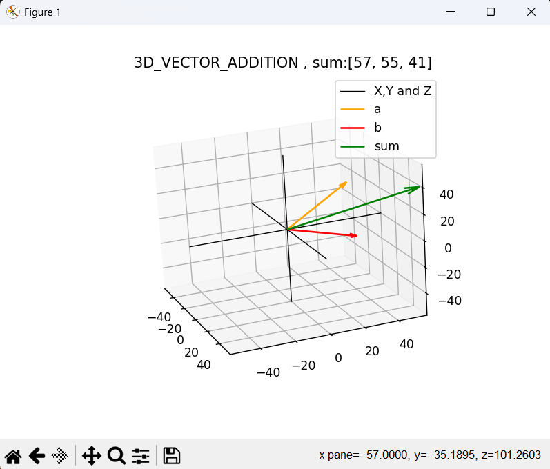
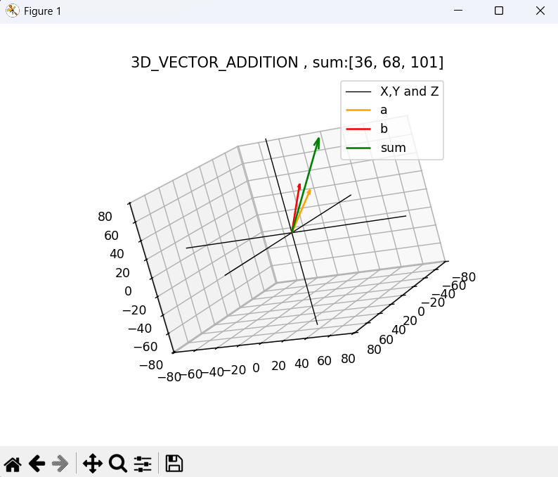

This simple python program helps you to visualize vectors addition in 3d:

requirments: 

1.python v3.13

2.matplotlib 

How to use :

1. First you can git pull this repo or you can copy paste the code . Then run this program using python

2. Now you enter the value of the vector which will be added as follows:

3. Thats it ! Now you can see your sum of the 2 vectors in 3d .

Tips:

->You can also rotate the 3d space by holding your left mouse click and moving 
->You can span in and out using right click in your mouse and moving